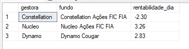

# Processo Seletivo 2021

# Projeto
O desafio aqui proposto se divide em 3 etapas:

1. Realizar o web scraping, usando Python, para adquirir dados de rentabilidade de 3 diferentes gestoras de ações, a partir de seus sites oficiais
2. Adquirir os mesmos dados de rentabilidade de 3 diferentes gestoras de ações, mas aprensentando um modo de coleta alternativo
3. Criar um banco de dados simples para armazenar os dados das coletas diárias das gestoras

# Como iniciar
1. Clone esse repositório em sua máquina local
2. Com o Python instalado, instale as bibliotecas de requisitos do projeto executando: ``pip install -r requirements.txt``
3. Realize as alterações no arquivo ``config.py``: mude o ``PROJECT_PATH`` para o caminho completo do local do projeto em sua máquina e mude o ``Server``, na variável ``dados_conexao``, com o nome do *hostname* da sua máquina. Obs. para encontrar esse *hostname*, abra o cmd e digite **hostname**.
4. A seguir, execute o arquivo ``main.py``, que realiza o webscraping, a atualização da tabela Excel e do banco de dados em SQL Server.

# Arquitetura da solução

## Estrutura de pastas
    -web_scraping/ : Realiza o webcraping dos dados dos fundos
        -constellation/ : Projeto scrapy 
        -dynamo/ : Projeto scrapy
        -nucleo/ : Projeto scrapy
        -CVM_backup/ : Webscraping a partir do site da CVM
        -rentabilidades_resultados/ : Resultados obtidos

    -integracao_python_excel/ : Salva dos dados em um SQL Server

    -integracao_python_sql/ : Salva os dados em uma tabela excel

    
## Web Scraping

Para executar a primeira etapa, utiliza-se a biblioteca Scrapy, onde foi criado um *Scrapy project* para cada gestora desejada, a partir dos seus sites oficiais: [Constellation](https://constellation.com.br/pra-voce/), [Nucleo](https://www.nucleocapital.com.br/) e [Dynamo](https://www.dynamo.com.br/pt). 

O ciclo de desenvolvimento de um *Scrapy project*, para uma gestora genérica, é descrito a seguir

1. Criação do diretório **web_scraping** que conterá os projetos Scrapy de cada gestora. No terminal: ``mkdir web_sraping`` e ``cd web_scraping``
2. Criação do projeto Scrapy: ``scrapy startproject [NOME_DA_GESTORA]``, sem colchetes
3. Navegação até a pasta do projeto criado: ``cd [NOME_DA_GESTORA]``
4. Criação do Spider de coleta para a gestora em questão: ``scrapy genspider ws[NOME_DA_GESTORA] [SITE_DA_GESTORA]``
5. Para testar o scraping, utiliza-se o ambiente de testes do Scrapy: ``scrapy shell``, onde é possível testar os comandos antes de implementá-los no script propriamente ditos 

    5.1 No ambiente de testes, para testar a conexão com o site da gestora: ``fetch('[SITE_DA_GESTORA]')``

    5.2 Para testar o scraping: ``response.css('[ELEMENTO]').get()``, onde esse [ELEMENTO] foi obtido utilizando a extensão Chrome [SelectorGadget](https://chrome.google.com/webstore/detail/selectorgadget/mhjhnkcfbdhnjickkkdbjoemdmbfginb?hl=pt-BR), para encontrar os elementos de interesse no site. 

    5.3 Para sair do ambiente de testes: ``quit()``

6. Finalizados os testes, preenche-se o arquivo **Exercicio1/web_scraping/[NOME_DA_GESTORA]/[NOME_DA_GESTORA]/spiders/ws[NOME_DA_GESTORA].py**, seguindo o modelo: 

```Python
def parse(self, response):
        yield{
        'rentabilidade_dia' : response.css('[ELEMENTO_CSS]').get().replace(',', '.'),
        'rentabilidade_ano' : response.css('[ELEMENTO_CSS]').get().replace(',', '.')
        }
```

7. Para executar o scrapy (fora do ambiente de testes) e salvar os resultados em arquivos JSON: ``scrapy crawl ws[NOME_DA_GESTORA] -O ..\rentabilidades_resultados\rentabilidades_[NOME_DA_GESTORA].json``

Seguindo esses etapas, foi feito a coleta da rentabilidade diária e anual de cada gestora. 

### Coleta alternativa

Foi feito um modo de coleta alternativa para se obter os mesmos dados, porém a partir do site da CVM. Aqui, a coleta foi feita a partir dos informes diários emitidos pela CVM. Os dados foram coletados para dezembro de 2021, o que pode ser configurado no método ``busca_informes_cvm``, e então processados a fim de se obter as rentabilidades dos fundos em questão. Todas as manipulações feitas estão no arquivo **webscraping_backup.py**. 

## Integração com o Excel

Dessa forma, a lógica aqui implementada foi: primeiramente, é tentado realizar o webscraping a partir dos sites das gestoras. Em seguida, se houver algum problema nessa coleta, é acionado o método alternativo de coleta (site da CVM), para garantir que houve a coleta dos dados. Assim, os dados obtidos são salvos em arquivos JSON e, a partir desses, a tabela Excel é atualizada, utilizando a biblioteca *Pandas*. O arquivo atualizado é chamado **tabela_rentabilidades.xlsx**.

## Integração com o SQL Server

Para criar um banco de dados para armazenar as informações de rentabilidade diária, foi utilizado o SQL Server, seguinte as seguintes etapas:

1. Dentro do ambiente SQL Server Management Studio (SSMS), foi criado um banco de dados chamado **BrasilCapitalDB**. Em seguida, foi criado uma tabela para armazenar os dados das cotas diárias das gestoras, executando a query  ``USE BrasilCapitalDB CREATE TABLE CotasDiarias(gestora varchar(50), fundo varchar(50), rentabilidade_dia decimal(6, 2))``, o que resultou em uma tabela do tipo: 



Tendo criado a tabela no SQL Server, foi utilizado a biblioteca pyodbc para se conectar ao banco e executar queries. No arquivo *python_sql.py* está sendo feito a conexão com o banco e a execução de comandos ``UPDATE CotasDiarias SET rentabilidade_dia={} WHERE gestora='{}'``, para atualizar os valores da tabela. Os dados que serão armazenados são aqueles fornecidos em arquivos JSON, pelo webscraping.

# Observação

Ao coletar os dados de rentabilidade anual dos fundos, para a etapa 2, eu encontrei problemas tanto para o site da Anbima quanto para o CVM. 
Minha primeira tentativa foi no site da CVM (onde, a partir dos informes diários, foi obtido a rentabilidade diária dos fundos), contudo eu não consegui encontrar os dados de rentabilidades anuais, pelo menos não para todos os fundos: a Constellation possui uma página (pdf) chamado "Lâmina de Fundo", que possui as informações de rentabilidades, porém as demais gestoras não possuem essa página. 

Dessa forma, fui para a abordagem a partir do site da Anbima. Tentei realizar o web scraping utilizando a biblioteca *Scrapy* e a *requests* em conjunto com a *BeautifulSoup*, contudo ambas abordagens não conseguiam retornar os valores desejados. Então, fui em busca da API da Anbima. Fiz o cadastro para ter acesso a API porém fui impedido de continuar esse método pois a conta gratuita, que eu criei, apenas possuia acesso ao ambiente SandBox da API, que funciona apenas para testes, impossibilitando o acesso a informações de qualquer fundo. Erro esse está mostrado [nesse notebook Python](https://colab.research.google.com/drive/1wqlK6HhhPk4s95g7uET8DFCbvuxyUp2r?usp=sharing).

Então, tendo falhado todas as minhas tentativas, não consegui realizar a coleta das rentabilidades anuais por meio de outro site, além dos oficiais das gestoras.
